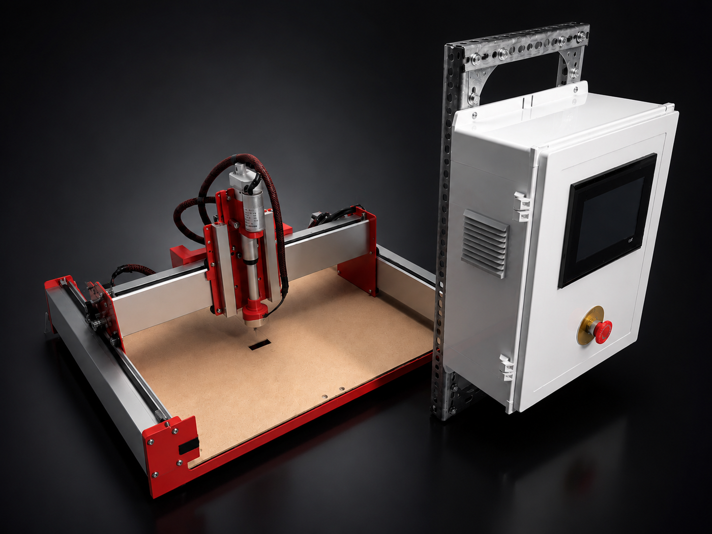
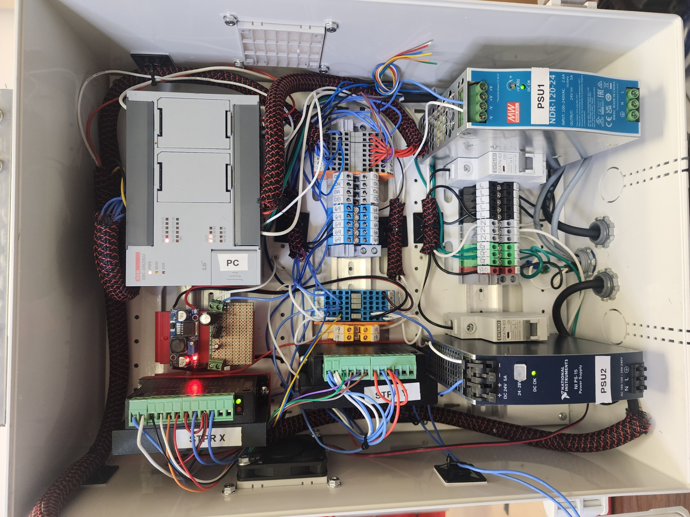
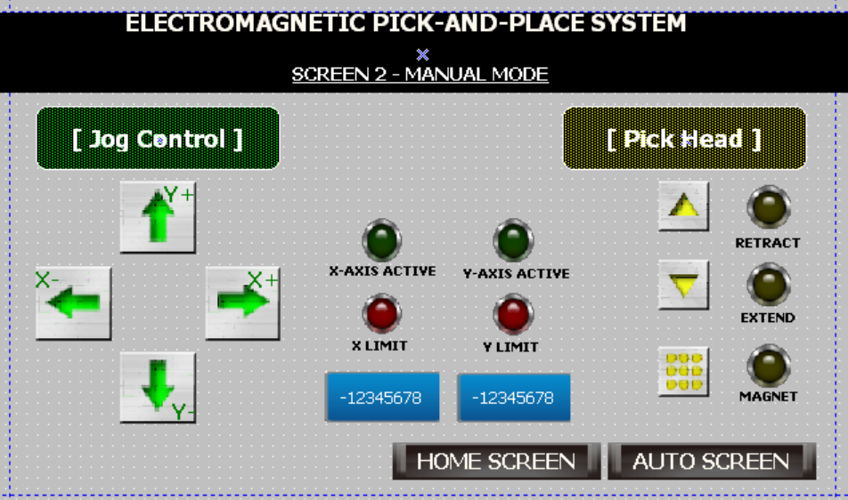

# plc-pick-and-place
3-axis PLC-controlled electromagnetic pick-and-place automation system with HMI, safety interlocks, and industrial-grade control panel — CSUN Senior Design 2026, 2nd Place

# PLC-Controlled Electromagnetic Pick-and-Place System

---

> **California State University, Northridge — ECE 493 Senior Design | Spring 2026**
> Team: Edgar Gutierrez · Ignacio Martinez-Laparra · Victor Jose Brito
> Faculty Advisor: Prof. Kourosh Sedghisigarchi
## System Photos

*Complete system — 3-axis gantry and industrial control panel*

*Control panel interior — PLC, dual PSUs, stepper drivers, DIN rail wiring*

*HMI manual control screen — jog controls, axis status, and pick head controls*

---

## Demo Video

*Click to watch the full system demo — manual jog, homing, and automated pick-and-place cycle*

---

## System Overview

This project is a fully functional 3-axis industrial automation prototype built from the ground up. An **LS Electric XBC-DN20SU PLC** coordinates stepper-driven gantry motion, a linear actuator, and an electromagnetic end-effector to perform repeatable pick-and-place cycles. The system features a custom **HMI** for both manual and automatic operation, a hardware-level **Emergency Stop**, and an industrial-grade control panel — all built to reflect real-world industrial automation standards.

The system supports:
- Manual jog control for setup and axis alignment
- Commanded positioning for repeatable, precise movement
- Fully automated pick-and-place, square, and triangle cycles
- Operator feedback via real-time HMI status indicators
- Hardware-interlocked safety layer independent of PLC logic

---

## My Role — Hardware, Power & Wiring Lead

I was responsible for the complete hardware build and electrical infrastructure of the system:

- **Panel Fabrication** — Built the control enclosure from scratch: cut slots for the HMI, E-Stop, and cable glands; laid out and mounted all DIN rail components including the PLC, dual PSUs, stepper drivers, circuit breakers, and terminal blocks
- **Point-to-Point Wiring** — Performed all electrical wiring from PLC I/O to panel terminals to gantry field devices, with full terminal labeling and professional cable management
- **Power Architecture** — Designed a dual-rail 24V DC power distribution system to isolate high-current motion noise from sensitive control logic across a 162W peak system load
- **Relay Isolation** — Configured interposing relay board wiring to resolve NPN sinking output mismatch between the PLC and relay coils
- **Gantry Assembly** — Assembled the full 3-axis mechanical gantry including stepper motors, linear actuator, end-effector mounts, and limit switch brackets
- **3D Printed Components** — Engineered and printed custom PETG mounts for the end-effector, limit switch brackets, and gantry junction box
- **Electrical Schematics** — Produced a professional 4-page schematic set in SkyCAD covering power distribution, motion control, relay isolation, and PLC I/O mapping
- **Ladder Logic** — Authored ladder logic routines for limit switch homing, electromagnet control, and linear actuator sequencing — delivered to teammate for system integration

---

## Key Specifications

| Parameter | Value |
|---|---|
| Motion Resolution | 0.012 mm/step |
| System Peak Load | 162W (6.75A @ 24V DC) |
| Power Architecture | Dual-rail 24V DC (2x 120W PSUs) |
| PLC | LS Electric XBC-DN20SU |
| HMI | LS Electric XP40TTA/DC |
| Stepper Drivers | TB6600 (3200 steps/rev) |
| Axes | 3-axis (X, Y, Z) |
| End-Effector | Linear Actuator + Electromagnet |
| Functional Tests Passed | 6 / 6 ✅ |
| Competition Result | **2nd Place** |

---

## Hardware Stack

| Component | Specification |
|---|---|
| PLC | LS Electric XBC-DN20SU (High-speed Pulse Output) |
| HMI | LS Electric XP40TTA/DC (RS-485) |
| Stepper Motors | NEMA 23, 1.8° step angle, 125 oz-in |
| Stepper Drivers | TB6600 (1.5A / 3200 steps/rev) |
| Linear Actuator | 24V DC, 750N Force, 50mm Stroke |
| Electromagnet | 24V DC, 6W holding power |
| Power Supply 1 | Mean Well NDR-120-24 (24V, 5A) |
| Power Supply 2 | National Instruments NI PS-15 (24V, 5A) |
| Relay Module | 8-Channel SPDT, 10A contacts, 24V coil |
| Gantry Frame | Shapeoko aluminum extrusions (GT2 belting) |
| Limit Switches | Mechanical lever micro-switches (NC) |

---

## Electrical Schematics

The full 4-page schematic set was designed in **SkyCAD Electrical** and documents the complete system interconnection.

| Sheet | Description |
|---|---|
| Sheet 1 | Power Distribution — Dual PSU strategy, E-Stop safety loop |
| Sheet 2 | Motion Control — X/Y stepper driver wiring |
| Sheet 3 | Relay Board/Gantry — Load isolation, actuator and magnet control |
| Sheet 4 | I/O Logic — PLC to HMI wiring, limit switch integration |

---

## Standards Compliance

| Standard | Application |
|---|---|
| UL 508A | Industrial control panel design and layout |
| NEC Article 409 | Industrial control panel wiring |
| IEC 60204-1 | Hardware E-Stop (Stop Category 0) |
| IEEE 1015 | Circuit breaker selection |
| IEEE C37.90 | Relay isolation |
| IEC 61131-3 | PLC ladder logic programming |
| ISA-101.01 | HMI design and usability |
| ANSI B11.0 | Machine safety requirements |

---

## Functional Test Results

| Test Case | Result |
|---|---|
| Jog Motion | ✅ Pass |
| Position Command | ✅ Pass |
| Actuator Control | ✅ Pass |
| Magnet Pickup | ✅ Pass |
| Limit Switch Protection | ✅ Pass |
| HMI Command Mapping | ✅ Pass |

---

## Project Documents

- 📄 [Hardware Integration Report (PDF)](./docs/Edgar_Gutierrez_Hardware_Report.pdf)
- 📊 [Final Team Presentation (PDF)](./docs/ECE493_Final_Presentation.pdf)
- 🔌 [Electrical Wiring Diagrams (PDF)](./docs/PLC_Pick_n_Place_WiringDiagram.pdf)

---

## Team Contributions

| Member | Role |
|---|---|
| **Edgar Gutierrez** | Hardware Lead — Electrical wiring, power distribution, panel fabrication, gantry assembly, schematics, ladder logic (homing, actuator, magnet) |
| Ignacio Martinez-Laparra | HMI Lead — Screen layout, operator interface, command buttons, status indicators |
| Victor Jose Brito | PLC Logic Lead — Ladder logic, motion control, actuator sequencing, limit switch integration |

---

*CSUN Department of Electrical & Computer Engineering | ECE 493 Senior Design | Spring 2026*
